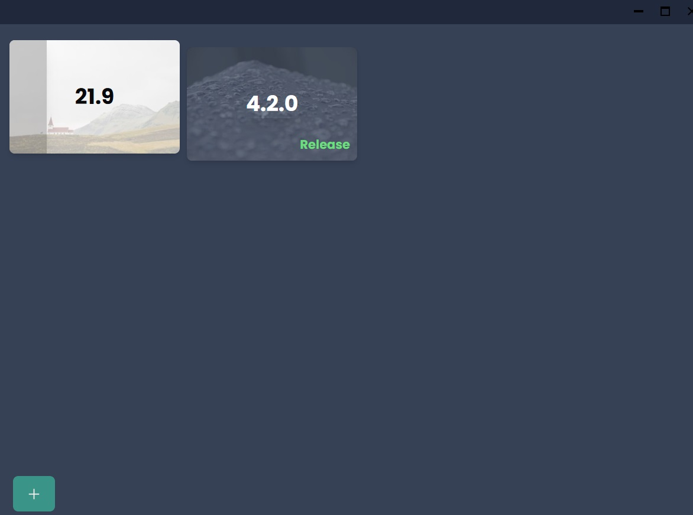

# Blender Version Manager built using Tauri

React for Frontend, Mix of Python and Rust for backend, with communication done by piping.

Clone and run with `tauri run dev`, make sure tauri is installed.

## Base window (downloading)

## Get instance dialog

